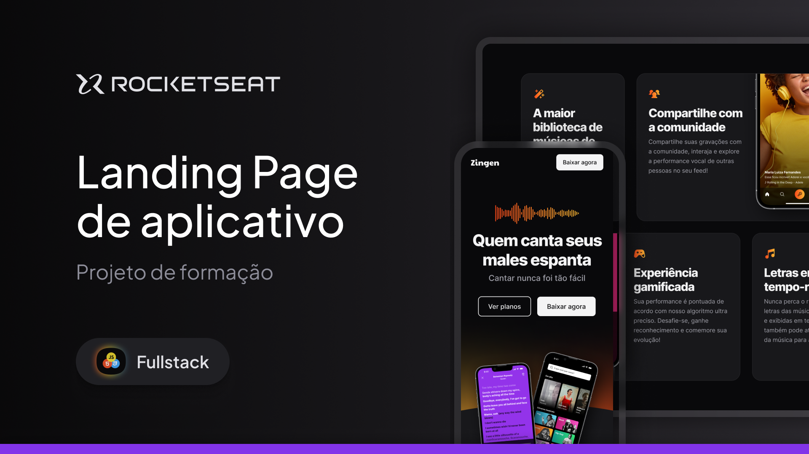

  <a href="#-tecnologias">Tecnologias</a>&nbsp;&nbsp;&nbsp;|&nbsp;&nbsp;&nbsp;
  <a href="#-projeto">Projeto</a>&nbsp;&nbsp;&nbsp;|&nbsp;&nbsp;&nbsp;
  <a href="#-layout">Layout</a>&nbsp;&nbsp;&nbsp;|&nbsp;&nbsp;&nbsp;
  <a href="#memo-licença">Licença</a>

  

# 🎤 Zingen - Landing Page de Aplicativo Karaokê

## 🚀 Sobre o Projeto

Este projeto é uma **Landing Page completa e responsiva**, criada para promover o **Zingen**, um aplicativo de Karaokê impulsionado por **Inteligência Artificial**.  
Foi desenvolvido como parte do desafio prático da formação **Full-Stack da Rocketseat**, dentro do módulo de especialização em Front-End.

O principal objetivo foi consolidar conhecimentos de **HTML5** e **CSS3**, elevando o nível com a **introdução a Media Queries**, permitindo a adaptação do layout para dispositivos mobile. Este é o **primeiro projeto em que implementei responsividade**, representando um marco importante na minha curva de aprendizado.

---

## ✨ O que você encontrará aqui

- 📱 **Primeiro contato real com Mobile-First e Media Queries:** adaptação completa para telas menores, aprendendo a priorizar experiência em smartphones.
- 💎 **Práticas avançadas de CSS:** tipografia fluida, espaçamentos proporcionais e refinamento visual do layout com base em um design do Figma.
- 🔎 **Exploração do conceito de Landing Pages:** estruturação orientada a conversão, com seções bem definidas (hero, features, CTA).
- 🚀 **Semântica HTML aprimorada:** headings consistentes, uso de sections e hierarchy clear para acessibilidade e SEO.
- 🐞 **Resolução autônoma de bugs:** lapidação dos detalhes ao longo do desenvolvimento, ajustando margens e alinhamentos.

---

## 🛠 Tecnologias

- **HTML5** — marcação semântica
- **CSS3** — estilização avançada, Media Queries e organização modular
- **Figma** — interpretação fiel do protótipo visual

---

## 💻 Projeto

O **Zingen** é apresentado como o **app perfeito para aprender a cantar**, pois conta com um algoritmo que remove a voz original das músicas mantendo as melodias intactas. Ao cantar, a voz do usuário é analisada em tempo real, comparando afinação e performance para ajudá-lo a evoluir.

O site foi construído como uma **Landing Page de marketing**, destacando benefícios, funcionalidades e chamadas para ação (CTA), otimizando para captar o interesse do visitante e levá-lo a baixar o app.

---

## 🔖 Layout

Você pode visualizar o layout do projeto através [desse link](https://www.figma.com/community/file/1371886246180677672/lp-de-produto).  
É necessário ter uma conta no [Figma](https://figma.com) para acessá-lo.

---

## 📬 Entre em Contato

---

## 📝 Licença

Este projeto foi desenvolvido como parte do programa educacional da Rocketseat.  
Feito com ♥ by Renan Guilherme & Rocketseat :wave: [Participe da nossa comunidade!](https://discordapp.com/invite/gCRAFhc)

---

  

